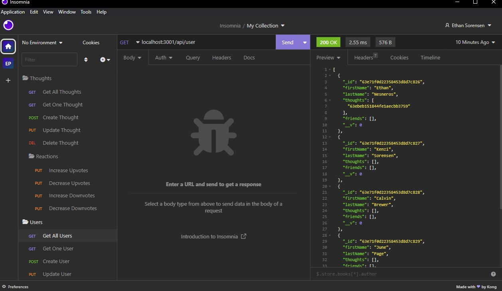

# c18-Social-Api

Demonstration Video - https://drive.google.com/file/d/1Cgg2fqZv93DROpXFUVVokquXIDjLqPib/view
# Table of Contents
<a href = 'https://github.com/EfSoren/c18-Social-API/edit/main/README.md#description'> Description</a> 
<a href = 'https://github.com/EfSoren/c18-Social-API/edit/main/README.md#installation'> Installation</a> 
<a href = 'https://github.com/EfSoren/c18-Social-API/edit/main/README.md#usage'> Usage</a> 
<a href = 'https://github.com/EfSoren/c18-Social-API/edit/main/README.md#questions'> Questions</a> 

## Description
This repo contains code designed for a social media api.  
You can view, create, edit, and delete users and thoughts.  
You can also add friends to your friendlist and react to other peoples posts.

## Installation
Clone the repo and install the required npm packages. 
You will need to have mongodb on your machine
Run the seed command to populate the database
You will also need a program such as insomnia or postman to make and view requests.

## Usage
You can test the endpoints listed in the routes folders to start creating and interacting

## Questions
Please look around my github to see what other projects i've done, or email me with any questions you may have
https://github.com/EfSoren
ef.sorensen@me.com

